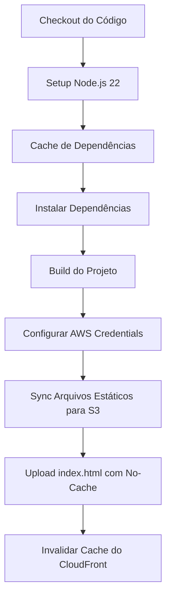

# Pipeline CI/CD - Deploy para AWS S3 e Invalidação CloudFront

## Resumo
Pipeline automatizado para build e deploy de aplicações web para AWS S3 com invalidação de cache no CloudFront.

O caso de uso é para aplicações web estáticas e a infraestrutura sugerida foi pensada para garantir alta disponibilidade e performance para aplicações web hospedadas na AWS, utilizando cache de conteúdo distribuído em Edge Locations via CDN (Content Delivery Network).

### Etapas do Pipeline:
- Checkout do código
- Configuração do Node.js (v22)
- Cache de dependências npm
- Instalação de dependências
- Build da aplicação
- Configuração das credenciais AWS
- Sincronização dos arquivos estáticos para o bucket S3 com uma estratégia de cache otimizada
- Upload especial do arquivo `index.html` com cabeçalhos de cache para garantir que sempre seja atualizado
- Invalidação do cache do CloudFront para refletir as mudanças imediatamente

## Índice

- [Execução](#execução)
- [Pré-requisitos](#pré-requisitos)
- [Configuração](#configuração)
- [Como Funciona](#como-funciona)
- [Estratégia de Cache](#estratégia-de-cache)
- [Uso](#uso)
- [Notas](#notas)
- [Licença](#licença)

## Execução

Este pipeline automatiza o processo de: 
1. **Build** da aplicação Node.js
2. **Deploy** dos arquivos estáticos para AWS S3
3. **Invalidação** do cache do CloudFront para garantir que as atualizações sejam refletidas imediatamente

### Quando o Pipeline é Executado

- Ao realizar a ação Push na branch `main`, conforme declarado em:

    ``` yaml
    on:
      push:
        branches:
          - main
    ```
- Ou ainda, manualmente via `workflow_dispatch`, através da interface do GitHub.

### Controle de Concorrência

O pipeline utiliza concurrency control para evitar deploys simultâneos, cancelando execuções em andamento quando um novo deploy é iniciado. Conforme declarado em:
``` yaml
concurrency:
  group: deploy-to-s3
  cancel-in-progress: true
```

## Pré-requisitos

### AWS
- Bucket S3 configurado para hospedagem de site estático
- Distribuição CloudFront apontando para o bucket S3
- IAM User com as seguintes permissões: 
  - `s3:PutObject`
  - `s3:DeleteObject`
  - `s3:ListBucket`
  - `cloudfront:CreateInvalidation`

### Projeto
- Aplicação Node.js (v22)
- Script `build` configurado no `package.json`
- Diretório de build:  `dist` (personalizável)

## Configuração

### 1. Criar Variáveis de Ambiente no GitHub

Para melhor organização, segurança e reutilização este script utiliza um Environment denominado `AWS`, que é configurado no repositório do projeto no GitHub.
  - Para criar o Environment:
    - Acesse o repositório no GitHub
    - Navegue até:  `Settings` → `Environments` → `New environment`
    - Insira o nome do Environment: neste caso é `AWS`, mas você pode nomear como desejar, desde que altere o nome no workflow em:
      ``` yaml
      jobs:
        build-and-deploy:
          runs-on: ubuntu-latest
          environment: AWS
      ```

### 2. Configurar Variáveis e Secrets

#### Variáveis

Aqui serão inseridas as variáveis de ambiente necessárias para o deploy, essas variáveis podem ter o seu valor lido e alterado por qualquer pessoa com acesso ao repositório.

  - Para criar as variáveis:
    - Acesse o repositório no GitHub
    - Navegue até:  `Settings` → `Environments` → selecione o Environment criado (neste caso `AWS`) -> `Add environment variable`
    - Insira as variáveis conforme a tabela abaixo:

| Nome | Descrição | Exemplo |
|------|-----------|---------|
| `S3_BUCKET` | Nome do bucket S3 | `meu-site-producao` |
| `AWS_REGION` | Região AWS do bucket | `us-east-1` |

#### Secrets

As secrets são utilizadas para armazenar informações sensíveis, como credenciais de acesso, que não devem ser expostas. O valor das chaves não pode ser visualizado após a sua criação, mas pode ser alterado sempre que necessário.

  - Para criar os secrets:
    - Acesse o repositório no GitHub
    - Navegue até:  `Settings` → `Environments` → selecione o Environment criado (neste caso `AWS`) -> `Add environment secret`
    - Insira os secrets conforme a tabela abaixo:

| Nome | Descrição |
|------|-----------|
| `AWS_ACCESS_KEY_ID` | Access Key ID do IAM User |
| `AWS_SECRET_ACCESS_KEY` | Secret Access Key do IAM User |
| `CLOUDFRONT_DISTRIBUTION_ID` | ID da distribuição CloudFront |

#### Ajustar Diretório de build

Ajuste a variável de ambiente `BUILD_DIR` se sua aplicação gera os arquivos em um diretório diferente de `dist`, o ajuste deve ser feito em:

```yaml
env:
  BUILD_DIR: dist
```

### Exemplo de Configuração IAM Policy:

As seguintes configurações de política IAM devem ser aplicadas ao usuário AWS que realizará o deploy. Essas são as permissões mínimas necessárias para que o pipeline funcione corretamente, caso seu usuário AWS tenha por exemplo as AmazonS3FullAccess e CloudFrontFullAccess, o deploy também funcionará, mas é uma prática recomendada seguir o **princípio do menor privilégio**.

```json
{
    "Version": "2012-10-17",
    "Statement": [
        {
            "Sid": "VisualEditor0",
            "Effect": "Allow",
            "Action": [
                "s3:PutObject",
                "s3:ListBucket",
                "s3:DeleteObject",
                "cloudfront:CreateInvalidation"
            ],
            "Resource": [
                "arn:aws:s3:::safepaws.nandorocha",
                "arn:aws:s3:::safepaws.nandorocha/*",
                "arn:aws:cloudfront::370587569222:distribution/E378MNEEAYV43V"
            ]
        }
    ]
}
```

## Como Funciona

### Fluxo do Pipeline



### Etapas Detalhadas

1. **Checkout**:  Clona o repositório
2. **Setup Node.js**: Configura Node.js v22 com cache de npm
3. **Cache npm**: Armazena dependências em cache para builds mais rápidos
4. **Install**: Executa `npm ci` (instalação limpa)
5. **Build**: Executa `npm run build` se o script existir
6. **AWS Credentials**: Configura credenciais para acesso à AWS
7. **Sync S3**: Sincroniza arquivos com estratégia de cache otimizada
8. **Upload index.html**: Faz upload especial do HTML principal
9. **CloudFront Invalidation**: Limpa o cache do CDN

## Estratégia de Cache

O pipeline implementa uma estratégia de cache em três camadas:

### 1. Assets Estáticos (1 ano)
  ```bash
  --cache-control "max-age=31536000, public"
  ```
  - Imagens, fontes e outros assets
  - Cache de longa duração
  - Exceto arquivos de `src/assets/` e `index.html`

### 2. JavaScript e CSS (5 minutos)
  ```bash
  --cache-control "max-age=300, public"
  ```
  - Arquivos `.js` e `.css`
  - Cache moderado para balancear performance e atualizações

### 3. index. html (Sem Cache)
  ```bash
  --cache-control "no-cache, no-store, must-revalidate"
  ```
  - HTML principal sempre atualizado
  - Garante que usuários recebam a versão mais recente

### Sync com Delete
  ```bash
  --delete
  ```
  Remove arquivos no S3 que não existem mais localmente.

## Uso

### Deploy Automático

Faça push para a branch `main`:
```bash
git add .
git commit -m "feat: nova feature"
git push origin main
```

### Deploy Manual

1. Acesse o repositório no GitHub na aba: `Actions` → `CI/CD - Build and Deploy to S3 and CloudFront invalidation`
2. Clique em `Run workflow`
3. Selecione a branch
4. Clique em `Run workflow`

## Notas

- O pipeline utiliza `npm ci` para instalação limpa e reproduzível de dependências
- Cache de dependências acelera builds subsequentes
- A invalidação do CloudFront pode levar alguns minutos para propagar globalmente
- O `if: ${{ always() }}` no upload do index.html garante execução mesmo se steps anteriores falharem

## Licença

Este template é de uso livre e pode ser adaptado conforme necessário.

---

**Criado por:** [@Fernando Henrique Rocha](https://github.com/FernandoHRocha)  
**Última atualização:** 2026-01-21